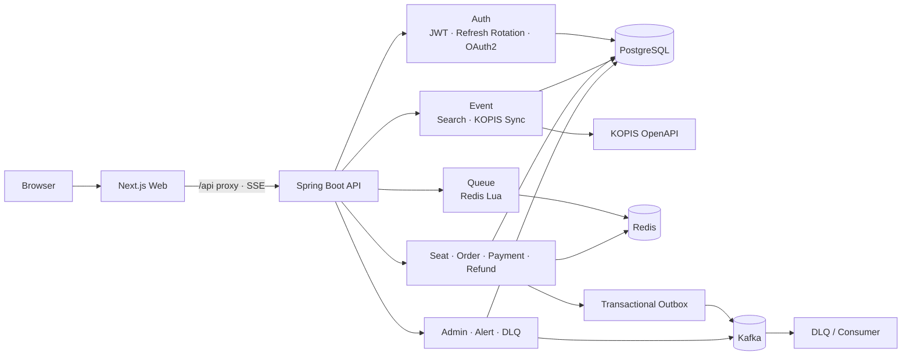
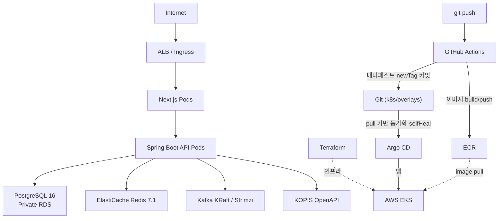
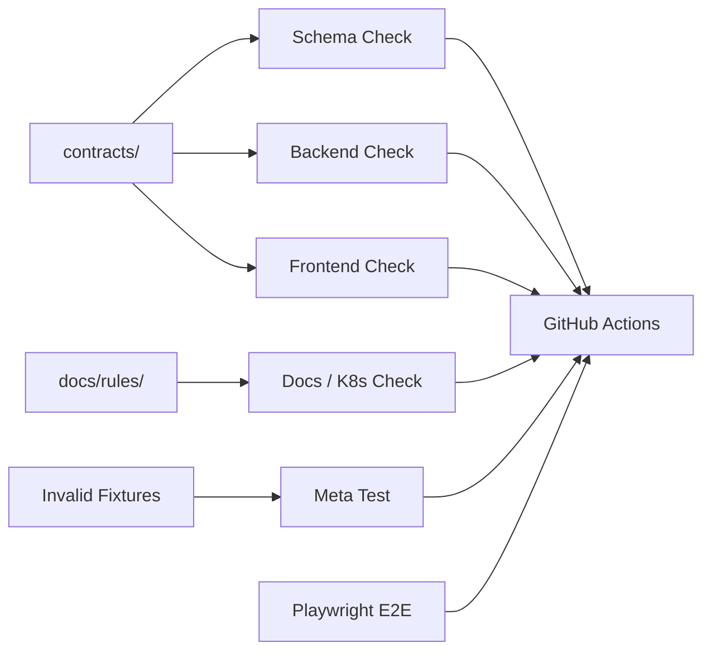

# FlowTicket

선착순 공연 예매 시스템입니다. 대기열·좌석 선점·주문·결제·환불을 하나의 수직 슬라이스로 다룹니다.

- **동시성 정합성** — 대기열·좌석·결제를 Redis Lua·조건부 `UPDATE`·멱등성 키로 원자화합니다.
- **GitOps 배포** — Terraform(인프라)과 Argo CD(앱)로 소유를 나눠 AWS EKS에 올립니다.
- **장애 주입 실증** — 배포·노드·DB·캐시에 실제로 장애를 넣고 앱의 거동을 측정합니다.

## 서비스 흐름

```text
공연 탐색 → 대기열 진입 → 입장 허용 → 좌석 선점 → 주문 생성 → 결제 → 예매 내역 / 환불
```

운영자는 공연·좌석을 관리하고, 주문·DLQ·알림 상태를 확인합니다. 공연 기본 정보는 KOPIS OpenAPI를 백엔드 배치가 동기화하며, 거래에 필요한 좌석·가격·재고는 FlowTicket이 직접 관리합니다.

## 핵심 설계

- **대기열**: Redis Lua 스크립트로 토큰 발급·입장 승격을 원자적으로 처리합니다.
- **좌석과 주문**: PostgreSQL 조건부 `UPDATE`와 영향 행 수 검증으로 중복 선점·초과판매를 막습니다.
- **결제 상태 전이**: 주문·결제·좌석·hold 상태를 명시적으로 전이하고 멱등성 키를 사용합니다.
- **이벤트 전달**: 비즈니스 트랜잭션과 Outbox 기록을 함께 저장하고 Kafka 발행·DLQ 처리를 분리합니다.
- **실시간 반영**: 대기열·좌석·주문 상태는 SSE와 재조회 보정으로 사용자 화면에 반영합니다.
- **외부 데이터 분리**: KOPIS 호출은 요청 경로가 아닌 배치 동기화 경로에서 처리합니다.

## 백엔드 아키텍처



백엔드는 Controller → Service → Repository/Gateway 경계로 구성됩니다. 위험 도메인에서는 일반적인 엔티티 저장보다 상태 조건을 포함한 명시적 전이를 우선합니다.

| 영역 | 책임 | 주요 구성 |
|---|---|---|
| 인증 | 회원가입·로그인·토큰 재발급·소셜 로그인 | JWT Access/Refresh, Redis rotation, Kakao/Naver OAuth2 |
| 공연 | KOPIS 동기화·검색·상세·인기 지표 | 스케줄 기반 동기화 작업, PostgreSQL |
| 대기열 | 발급·순번 조회·입장 승격·만료 | Redis, Lua, SSE |
| 예매 | 좌석 hold·주문·결제·환불 | JPA, QueryDSL, 조건부 UPDATE, 멱등성 |
| 이벤트 | 주문 완료 이벤트와 실패 격리 | Transactional Outbox, Kafka, DLQ |
| 운영 | 공연·주문·DLQ·알림 관리 | Spring Security RBAC, 관리자 API |

## 인프라 아키텍처



배포는 **push가 아니라 pull**이다. CI는 이미지를 ECR에 올리고 매니페스트의 태그를 Git에
커밋하는 데서 멈추며(`.github/workflows/image.yml`), 클러스터에 적용하는 것은 Argo CD다.
`Terraform=인프라 / Argo CD=앱`으로 소유를 나눈다 — 근거는
[ADR-009](docs/decisions/ADR-009-gitops-cd-argocd.md).

- 로컬 개발·통합 환경은 Docker Compose로 PostgreSQL, Redis, Kafka, API를 구성합니다.
- 클러스터 구성은 Kubernetes manifests와 Terraform을 사용하며, API는 health probe, graceful shutdown, HPA/PDB 설정을 가집니다.
- 비밀값은 환경변수와 External Secrets 경로로 주입하며 코드에 저장하지 않습니다.
- 배포·운영 문서는 [docs/deployment](docs/deployment/_index.md)와 [infra](infra)에서 관리합니다.

## 실증 — 눌러 보고 잽니다

선착순 예매는 **틀려도 조용히 틀립니다.** 좌석이 두 번 팔리거나 대기열 순번이 뒤집혀도 화면은 멀쩡해 보입니다. 그래서 막는 층을 나누고, 마지막 층은 **실제로 눌러 봅니다.**

### 롤링 배포 중 502 — 흔한 처방이 원인이 아니었다

통상 `deregistration_delay`를 늘리지만 **지표는 그 값과 무관함을 보여줬습니다.** 실패 지연이 정확히 `10,000ms`에 몰렸고 `Target_5XX = 0` — 애플리케이션은 5xx를 낸 적이 없었습니다. 문제 구간은 타깃이 `deregistering`이 되기 **전**, 파드는 이미 응답을 멈췄는데 ALB는 아직 정상 타깃으로 아는 구간이었습니다.

늘려야 할 것은 드레이닝이 아니라 **컨테이너가 살아 있는 시간**(`preStop`)이었습니다.

| 조건 | 요청 | 5xx |
|---|---|---|
| `preStop` 5s | 6,001 | 실패 |
| `preStop` 25s | 6,001 | **0** |

*다른 클러스터 조건에서는 `preStop 5s`에서도 재현되지 않아, 25초를 환경 불변의 최소값으로 보지는 않습니다. ([TS-035](docs/troubleshooting/TS-035-rolling-deregistration-race.md) · [IMP-015](docs/improvements/IMP-015-rolling-zero-downtime.md))*

### 세 층으로 막습니다

| 층 | 무엇을 막나 | 어떻게 |
|---|---|---|
| **코드** | 동시성 정합성 | Redis Lua로 대기열 승격을 원자화, 좌석·주문은 조건부 `UPDATE` + 영향 행 수 검증, 이벤트는 Transactional Outbox |
| **CI** | 구조 드리프트 | 계약(enum·API·이벤트·계층)을 파일로 두고 정적 검사. **일부러 만든 위반 fixture 44개로 "규칙이 실제로 잡는지"를 메타테스트가 판정**합니다 — 규칙을 믿지 않고 규칙을 시험합니다 |
| **실측** | 운영 중 장애 | 클러스터를 띄우고 장애를 **주입**합니다. 롤링 배포·노드 오토스케일([IMP-021](docs/improvements/IMP-021-cluster-autoscaler-node-scaling.md))·RDS/Redis 페일오버([TS-037](docs/troubleshooting/TS-037-rds-redis-failover-app-behavior.md)) |

⚠️ **측정 조건을 함께 적습니다.** 위 장애 주입 측정의 부하는 25~400 rps로, 용량 한계를 재는 값이 아닙니다. 용량 한계(knee)는 2026-08-11에 **600~650 rps**로 실측했고, 이후 개선(외부 호출 제거·캐시)을 반영한 **재측정은 진행 중**입니다([TS-034](docs/troubleshooting/TS-034-loadtest-path-generator-node-contention.md)).

**좋아진 수치만 싣지 않습니다.** RDS 페일오버에서 찾은 결함(30초를 다 기다린 뒤 500)을 고쳐 같은 장애를 다시 쟀습니다. 결과는 이렇습니다.

```
실패 요청의 대기 시간 총합   4,514초 → 1,341초   (−70%)
실패 건수                      181 → 400건       (+121%)
```

**개선이 아니라 트레이드오프였습니다.** 그렇게 기록했고, 한 번 잰 값으로는 채택하지 않았습니다([IMP-022](docs/improvements/IMP-022-rds-connection-timeout.md)). 측정 도구가 조용히 틀려 결론이 뒤집힐 뻔한 일도 있었고, 그것도 남겼습니다([TS-036](docs/troubleshooting/TS-036-measurement-tooling-false-failures.md)).

## 기술 스택

| 영역 | 기술 |
|---|---|
| Backend | Java 17 (Temurin), Spring Boot 3.3.x, Gradle 8, Spring Web, Spring Security, Spring Data JPA, QueryDSL 5 (Jakarta) |
| Data & Messaging | PostgreSQL 16, Flyway, Redis (Lettuce) — 로컬·CI `7.4` / ElastiCache `7.1`, Kafka KRaft, DLQ |
| Authentication | JWT Access/Refresh, OAuth2 Client, Kakao·Naver |
| Frontend | Node.js 20 LTS, pnpm 9, Next.js 14.2 App Router, TypeScript 5.5 |
| Frontend State & UI | Tailwind CSS 3.4, shadcn/ui, TanStack Query 5, Zustand 4, React Hook Form 7, Zod 3 |
| Infrastructure | Docker Compose v2, Kubernetes, Terraform, Argo CD, AWS EKS |
| Verification | JUnit 5, Testcontainers 1.20, Playwright, k6, GitHub Actions |

## 저장소 구조

```text
apps/
  api/                 Spring Boot API, Flyway migration, 도메인·인프라 코드
  web/                 Next.js App Router 사용자·운영 화면
assets/screens/        화면 레퍼런스 이미지
contracts/             enum, API, event, error, stack, layer 계약
docs/
  common/              공통 API·레이아웃·디자인 시스템
  rules/               도메인·백엔드·프론트 규칙
  screens/             기능 슬라이스와 화면 스펙
  decisions/           ADR 설계 결정
  improvements/        IMP 측정 기반 개선 기록
  troubleshooting/     TS 장애·회고 기록
  deployment/          배포·인프라 문서
  testing/             E2E·성능 검증 규칙
e2e/                   Playwright 크리티컬 플로우
harness/               계약·구조 드리프트 정적 검사
infra/                 Docker Compose, Terraform, k6
k8s/                   Kubernetes base, overlay, Kafka, monitoring, Argo CD
```

## 품질 검증 방식

하네스는 이 프로젝트의 기능 자체가 아니라, 기능 구현이 계약과 규칙에서 벗어나지 않는지 확인하는 안전망입니다.



검증은 다음 원칙을 따릅니다.

- 계약 파일에서 enum·API·이벤트·오류·계층 경계를 관리합니다.
- 하네스는 계약 형식, 백엔드·프론트 구조, Kubernetes·문서의 알려진 드리프트를 검사합니다.
- 메타테스트는 일부러 만든 위반 fixture가 실제로 차단되는지 확인합니다.
- 단위·통합 테스트는 동시성, 상태 전이, 인증, Outbox/Kafka 같은 런타임 정합성을 검증합니다.
- Playwright E2E와 k6는 사용자 흐름과 부하 상황을 확인합니다.

하네스의 범위, 명령, 검사 한계는 [docs/HARNESS.md](docs/HARNESS.md)에 정리되어 있습니다.

## 문서 지도

| 목적 | 문서 |
|---|---|
| 현재 기능 슬라이스·화면 상태 | [docs/screens/_index.md](docs/screens/_index.md) |
| 도메인 불변식 | [docs/rules/domain-rules.md](docs/rules/domain-rules.md) |
| API·이벤트·enum 계약 | [contracts](contracts) |
| 공통 API·레이아웃·디자인 | [docs/common](docs/common) |
| 설계 결정과 대안 | [docs/decisions](docs/decisions/_index.md) |
| 측정 기반 개선 기록 | [docs/improvements](docs/improvements/_index.md) |
| 장애 분석과 재발 방지 | [docs/troubleshooting](docs/troubleshooting/_index.md) |
| 배포·E2E·성능 검증 | [docs/deployment](docs/deployment/_index.md), [docs/testing](docs/testing/e2e-rules.md) |

## 작업 원칙

기능은 화면 하나가 아니라 **DB 스키마 → API → 프론트 화면 → 통합 검증**의 수직 슬라이스로 완성합니다. 위험 도메인인 대기열·좌석·결제·환불을 변경할 때는 해당 도메인 규칙과 ADR을 먼저 확인합니다.

상세 작업 규칙은 [AGENTS.md](AGENTS.md), 계약·하네스의 상세 설명은 [docs/HARNESS.md](docs/HARNESS.md)를 참고합니다.
